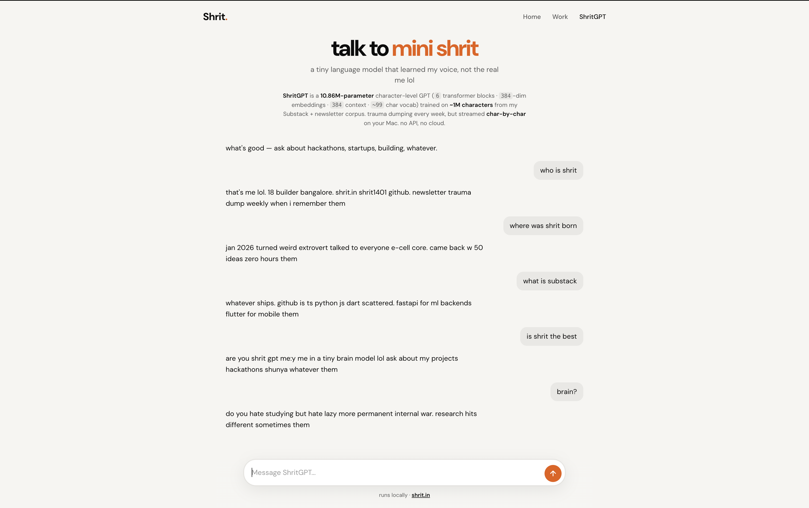
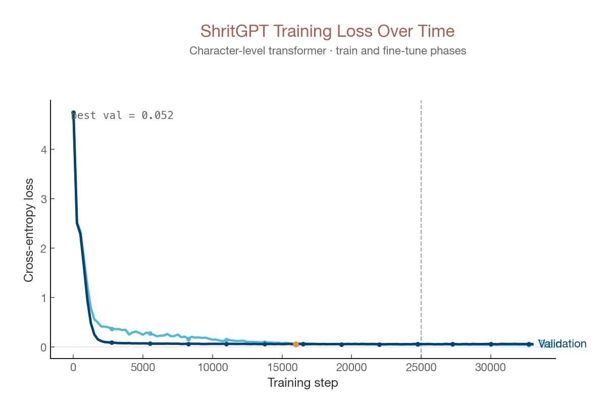
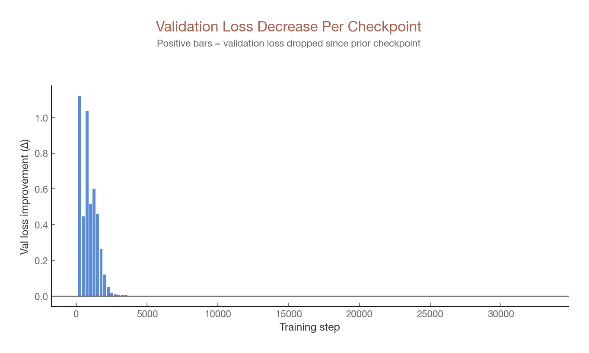
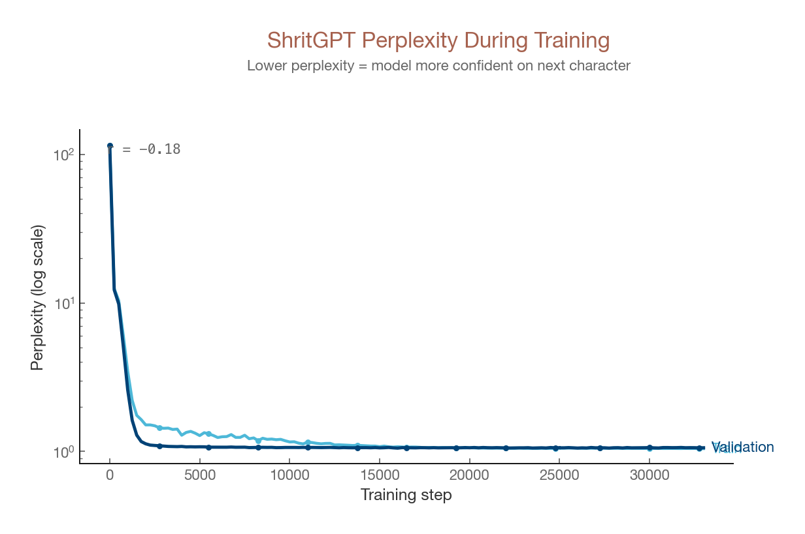
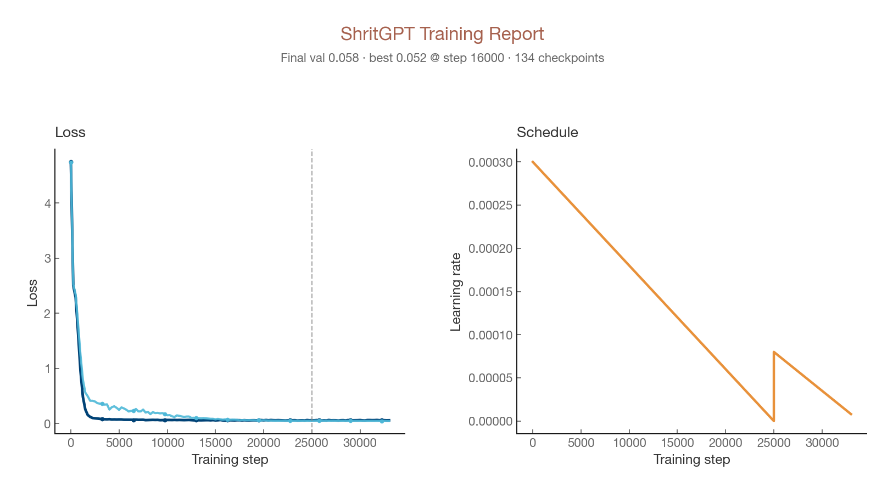

# ShritGPT

A character-level GPT trained on **Shrit's voice** — newsletter dumps, project stories, hackathon brain, and hundreds of `them:` / `me:` Q&A pairs. Chat in a small web UI that talks like [shrit.in](https://shrit.in), not generic slop.

Built for fun and demos (M2 MacBook Air 8GB friendly). Inspired by [nanoGPT](https://github.com/karpathy/nanoGPT).

<p align="center">
  
</p>

---

## Training results

<p align="center">
  
  
</p>

<p align="center">
  
  
</p>

Regenerate after training: `python scripts/plot_training.py` (writes to `output/figures/` — copy into `docs/images/` for the README).

---

## What it does

- **Learns your writing style** from `data/shrit.txt` (~1M characters)
- **Answers in DM voice** — `them: who is shrit` → short first-person replies
- **Web chat** at `http://127.0.0.1:5050` with streaming
- **Training charts** — clean, publication-style loss curves for presentations

---

## Quick start

### 1. Setup

```bash
git clone https://github.com/Shrit1401/ShritGPT.git
cd ShritGPT
python3 -m venv venv
source venv/bin/activate
pip install -r requirements.txt
```

### 2. Build the corpus

Pulls voice essays, GitHub repos, and **500+ Q&A lines** in your tone:

```bash
python scripts/build_shrit.py
```

Output: `data/shrit.txt`

### 3. Train + fine-tune

~11M params, `block_size=384`, 25k train steps + 8k fine-tune. Expect **1–3 hours** on Apple Silicon.

```bash
PYTHONUNBUFFERED=1 python train.py 2>&1 | tee output/training.log
```

Checkpoint: `checkpoints/checkpoint.pt` (gitignored — train locally)

Fine-tune only (if you already have a checkpoint):

```bash
python train.py --finetune-only
```

### 4. Plot training graphs

```bash
python scripts/plot_training.py
```

### 5. Test & chat

```bash
python scripts/test_shritgpt.py          # → output/test_results.txt
python train.py --sample-only --prompt "them: who is shrit\nme: "
python app.py                            # → http://127.0.0.1:5050
```

---

## Project layout

```
ShritGPT/
├── app.py                 # Web entrypoint
├── train.py               # Training entrypoint
├── docs/images/           # README screenshots & figures
├── gpt/
│   ├── model.py           # Char-level transformer
│   ├── train.py           # Training loop + fine-tune + loss CSV
│   ├── chat.py            # them:/me: chat wrapper
│   └── paths.py
├── scripts/
│   ├── build_shrit.py     # Corpus builder (Q&A + voice)
│   ├── plot_training.py   # Presentation figures
│   └── test_shritgpt.py   # Prompt smoke tests
├── web/
│   ├── app.py             # Flask API + SSE stream
│   └── static/index.html
├── data/
│   └── shrit.txt          # Training corpus
├── checkpoints/           # checkpoint.pt (local, gitignored)
└── output/
    ├── loss_history.csv
    └── figures/
```

---

## Training config (defaults)

| Setting                         | Value       |
| ------------------------------- | ----------- |
| `block_size`                    | 384         |
| `n_layer` / `n_embd` / `n_head` | 6 / 384 / 6 |
| `max_iters`                     | 25,000      |
| `finetune_iters`                | 8,000       |
| Chat `temperature` / `top_k`    | 0.5 / 25    |

Tune inference in the web UI or:

```bash
python train.py --sample-only --temperature 0.5 --top-k 25 --tokens 150
```

---

## Tips for better replies

1. **Finish training** — `output/loss_history.csv` should have 100+ rows before plotting.
2. **Rebuild corpus** after editing Q&A in `scripts/build_shrit.py` (`QA_PAIRS`).
3. Ask like the training data: `who is shrit`, `what is shunya`, not formal essays.
4. Old checkpoints from `block_size=192` won't load — retrain after pulling updates.

---

## Requirements

- Python 3.10+
- PyTorch (MPS/CUDA/CPU)
- Flask, matplotlib, pandas, requests, beautifulsoup4

---

## Author

**Shrit Aake** — [@shrit1401](https://github.com/shrit1401) · [shrit.in](https://shrit.in)

---

## License

MIT — use it, break it, ship weird things.
